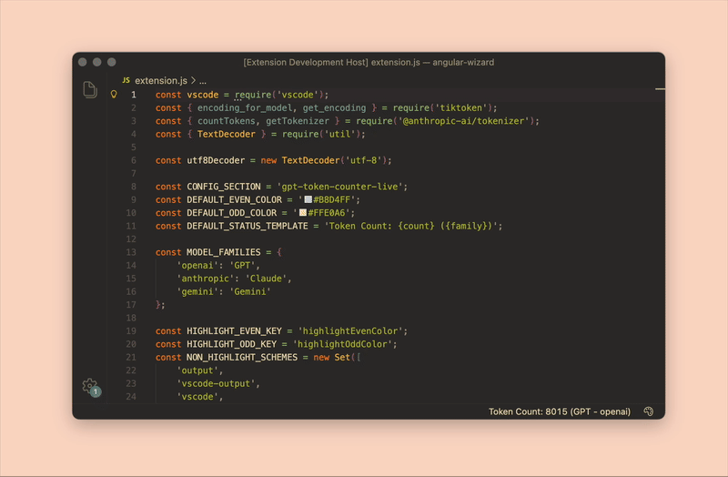
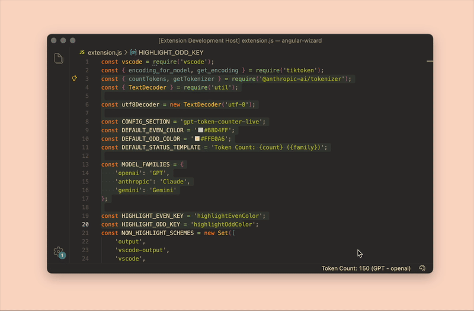
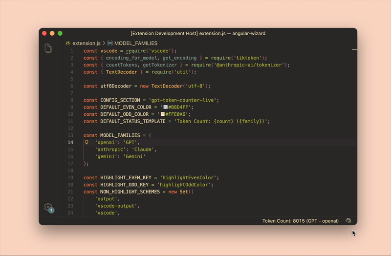
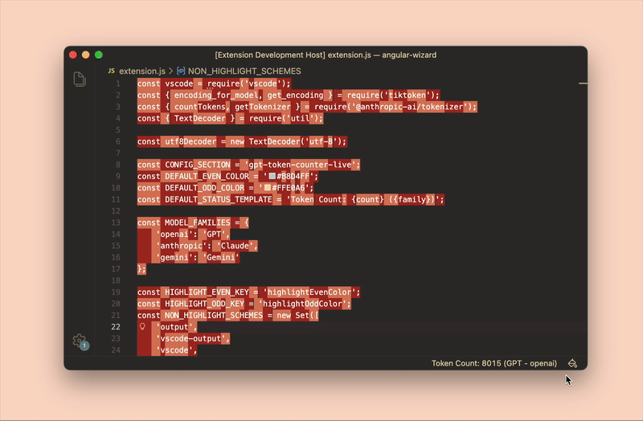
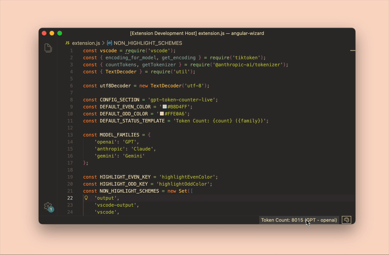

<div align="center">
    <h1>Live LLM Token Counter</h1>
    <br>
    <a href="https://marketplace.visualstudio.com/items?itemName=bedirt.gpt-token-counter-live"></a>
    <a href="https://open-vsx.org/extension/bedirt/gpt-token-counter-live"></a>
    <br><br>
</div>

The "gpt-token-counter-live" is a Visual Studio Code extension that displays the token count of selected text or the entire open document in the status bar. The token count is determined per model family using: [GPT via tiktoken](https://www.npmjs.com/package/tiktoken), [Claude via Anthropic's tokenizer](https://github.com/anthropics/anthropic-tokenizer-typescript), and Gemini via a local approximation.

**NEW in v1.4.0:** Now with **visual token highlighting** overlays! See exactly where token boundaries are as you type, with customizable colors and smart text contrast.

This tool is built to get a speedy token counting result right on VS Code while you are working on prompting files. I personally needed a lot while working on many LLM projects, so I decided to make one for myself. I hope this helps you too!

<div align="center">
    
</div>

## Features

### Real-Time Token Counting

**Live token counting** for the current selection or entire document, displayed directly in the status bar. Counts update automatically as you type or change your selection.

### Multi-Model Family Support

Click the status bar to **switch between model families**: GPT (OpenAI), Claude (Anthropic), Gemini (Google AI), or Qwen (Alibaba).

<div align="center">
    
</div>

- **GPT (OpenAI):** Uses tiktoken `encoding_for_model('gpt-5')` with fallbacks to `o200k_base` → `cl100k_base` for accurate token counting across all GPT models.
- **Claude (Anthropic):** Uses Anthropic's official tokenizer for precise token boundaries with full highlighting support.
- **Gemini (Google AI):** Approximates tokens using GPT encodings or ~4 chars/token fallback (highlighting not available).
- **Qwen (Alibaba):** Uses the official Qwen tokenizer via a local Python server for precise token counting with full highlighting support.

### Visual Token Highlighting

**See your tokens in real-time** with alternating color bands that show exactly where each token begins and ends. Available for GPT, Claude, and Qwen models.

<div align="center">
    
</div>

**Key features:**

- **Toggle on/off:** Click the palette icon in the status bar to enable/disable highlighting
- **Smart text contrast:** Foreground text color automatically adapts to your highlight colors for optimal readability
- **Customizable colors:** Choose your own colors with full alpha/transparency support
- **Editor-aware:** Only highlights in text editors; Output/Debug panes remain clean

### Customizable Highlight Colors

Open the **Command Palette** and run `Configure Token Highlight Colors` to access a dedicated color configurator.

<div align="center">
    
</div>

**Features:**

- Separate color pickers for even/odd token bands
- Hex color input with opacity sliders
- Live preview showing exactly how colors will look
- Smart contrast preview so you can ensure text remains readable

### Customizable Status Bar Display

Personalize how token information appears in your status bar using template placeholders.

<div align="center">
    
</div>

**Supported placeholders:**

- `{count}` - Token count
- `{family}` or `{model}` - Model family name (GPT, Claude, Gemini, Qwen)
- `{provider}` - Provider name (openai, anthropic, gemini, qwen)

## Requirements

- Visual Studio Code: The extension is developed for VS Code and will not work with other editors.
  - It is also hosted on the [Open VSX Registry](https://open-vsx.org/extension/bedirt/gpt-token-counter-live).

### Qwen Model Requirements

To use Qwen tokenization with highlighting support, you need:

1. **Python 3.7+** installed on your system
2. **transformers library**: Install with `pip install transformers`
3. **Optional: Auto-start server**: Enable `gpt-token-counter-live.qwenAutoStartServer` setting

**Setup Instructions:**

```bash
# Install transformers library
pip install transformers

# Verify Python path in VS Code settings if needed:
# Settings → Extensions → Live LLM Token Counter → Qwen Python Path
```

**Manual Server Start (if auto-start is disabled):**

```bash
python scripts/qwen_token_server.py
```

## Commands

This extension provides the following commands (accessible via Command Palette):

- **`Change Model Family`**: Switch between GPT (OpenAI), Claude (Anthropic), Gemini (Google AI), and Qwen (Alibaba) tokenizers. Also accessible by clicking the token count in the status bar.

- **`Toggle Token Highlighting`**: Enable or disable visual token highlighting overlays. Also accessible by clicking the palette icon in the status bar.

- **`Configure Token Highlight Colors`**: Open an interactive color configurator to customize the highlight colors for even and odd token bands. Includes live preview and smart text contrast.

- **`Count Tokens`**: Manually trigger token counting for the current document or selection.

## Extension Settings

This extension contributes the following settings:

### Model & Display Settings

- **`gpt-token-counter-live.defaultModelFamily`**: Choose which model family activates by default when you open VS Code.
  - Options: `openai`, `anthropic`, `gemini`, or `qwen`
  - Default: `openai`

- **`gpt-token-counter-live.statusBarDisplayTemplate`**: Customize how token information appears in the status bar.
  - Default: `Token Count: {count} ({family})`
  - Supported placeholders: `{count}`, `{family}`, `{model}` (alias for family), `{provider}`

### Qwen Configuration

- **`gpt-token-counter-live.qwenTokenServerUrl`**: URL of the local Qwen token counter service.
  - Default: `http://127.0.0.1:8009/qwen/tokenize`
  - Can be customized if running server on different port/host

- **`gpt-token-counter-live.qwenAutoStartServer`**: Automatically start the local Qwen token server when Qwen model family is used.
  - Default: `false`
  - Requires Python and transformers library to be installed

- **`gpt-token-counter-live.qwenPythonPath`**: Python executable to use for starting the local Qwen token server.
  - Default: `python`
  - Examples: `python3`, `C:\\Python39\\python.exe`, `/usr/bin/python3`

### Highlighting Configuration

Token highlight colors are stored in your VS Code global state (synced across devices if you have Settings Sync enabled). To customize them select `Configure Token Highlight Colors` option from the Command Palette.

**Quick toggle:** Click the palette icon in the status bar to enable/disable token highlighting instantly.

## Known Issues

There are currently no known issues. If you encounter a problem, please report it on the [issue tracker](https://github.com/BedirT/LLM-Token-Counter-VSCode/issues).

## Release Notes

### 1.4.0 - Token Highlighting & Customization

**Major new features:**

- **Visual Token Highlighting**: See exactly where each token begins and ends with alternating color bands overlaid on your text
  - Available for GPT (OpenAI), Claude (Anthropic), and Qwen (Alibaba) tokenizers
  - Smart text contrast automatically adjusts foreground color for readability
  - Editor-aware: only applies to text editors, keeps Output/Debug panes clean

- **Interactive Color Configurator**: New command `Configure Token Highlight Colors` with:
  - Separate color pickers for even and odd token bands
  - Hex color input with opacity sliders for full alpha support
  - Real-time preview showing exactly how colors will appear
  - Smart contrast preview ensures text remains readable

- **Status Bar Palette Toggle**: Quick access toggle button in status bar
  - Click to instantly enable/disable token highlighting
  - Visual states: Active (on), Inactive (off), Unavailable (for unsupported models)

- **Qwen Token Highlighting Support**: Full token highlighting now available for Qwen models
  - Uses official Qwen tokenizer via local Python server
  - Precise token boundaries with offset mapping
  - Same highlighting quality as GPT and Claude models

- **New Configuration Settings**:
  - `defaultModelFamily`: Choose which model family (GPT, Claude, Gemini, or Qwen) activates by default
  - `statusBarDisplayTemplate`: Customize status bar text with template placeholders like `{count}`, `{family}`, `{provider}`
  - `qwenAutoStartServer`: Automatically start Qwen token server when needed
  - `qwenPythonPath`: Custom Python executable path for Qwen server
  - `qwenTokenServerUrl`: Custom URL for Qwen token server

**Technical improvements:**

- Better Unicode normalization handling for Claude tokenizer (NFKC)
- Performance optimizations for real-time highlighting
- Improved error handling and user feedback
- Enhanced Qwen server with offset mapping for precise highlighting

### 1.3.0

- Switch to model families in the UI: GPT, Claude, Gemini.
- Add Gemini token counting (approximate: `o200k_base`/`cl100k_base`, fallback ~4 chars/token).
- GPT tokenizer now uses `encoding_for_model('gpt-5')` with graceful fallbacks.
- Updated `tiktoken` to 1.0.22.

### 1.2.3

- Added support for new OpenAI models: o3-mini, o1, o1-mini, gpt-4o-mini
- Updated to tiktoken 1.0.20
- Updated Claude models to only include Claude-3.5, Claude-3.7
- Removed older models: text-davinci-003, davinci, babbage
- Removed Claude-2 and Claude-3

### 1.2.1

- Moved from `gpt-tokenizer` to `tiktoken` package.
- Fixed the special tokens issue.

### 1.2.0

- Modified the code to increase security.
- Added support for GPT-4o tokenizer.
- Removed unused models from the tokenizer list.
- Added Claude-3 as option using approximate token count.

### 1.1.0

- Added support for Claude tokenizer.

### 1.0.0

- Initial release of gpt-token-counter-live.
- Provides a token count in the status bar for the selected text or the entire document.
- Automatically updates the token count as text is edited or selected.
- Allows the user to select the model to use for token counting.
